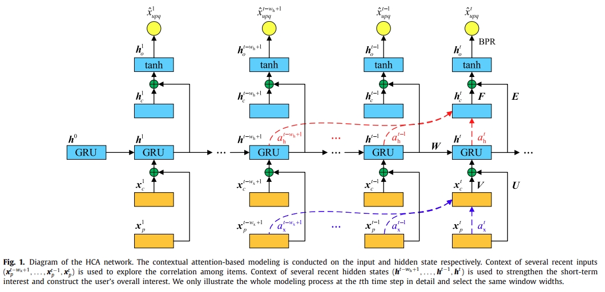

# HCA



This is the code for the Neurocomputing 2019 Paper: [A Hierarchical Contextual Attention-based Network for Sequential Recommendation](https://www.sciencedirect.com/science/article/pii/S0925231219306642).

## Usage


## Requirements

- Python27
- Theano

## Citation

Please cite our paper if you use the code:
```
@article{cui2019hierarchical,
  title={A Hierarchical Contextual Attention-based Network for Sequential Recommendation},
  author={Cui, Qiang and Wu, Shu and Huang, Yan and Wang, Liang},
  journal={Neurocomputing},
  year={2019},
  publisher={Elsevier}
}
```

## Contact information

If you have other questions or confusions, please send email to [cuiqiang1990@hotmail.com](mailto:cuiqiang1990@hotmail.com).
